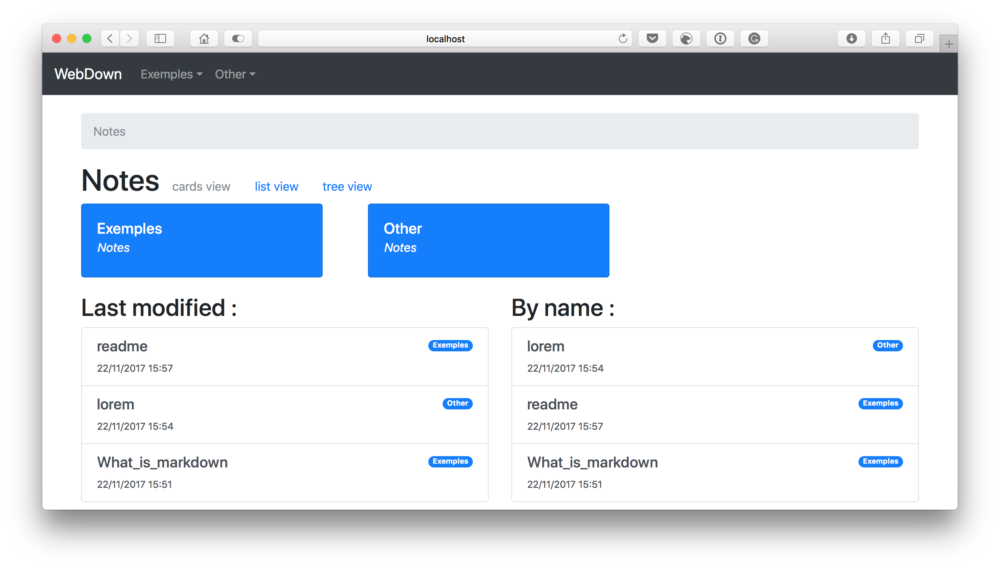
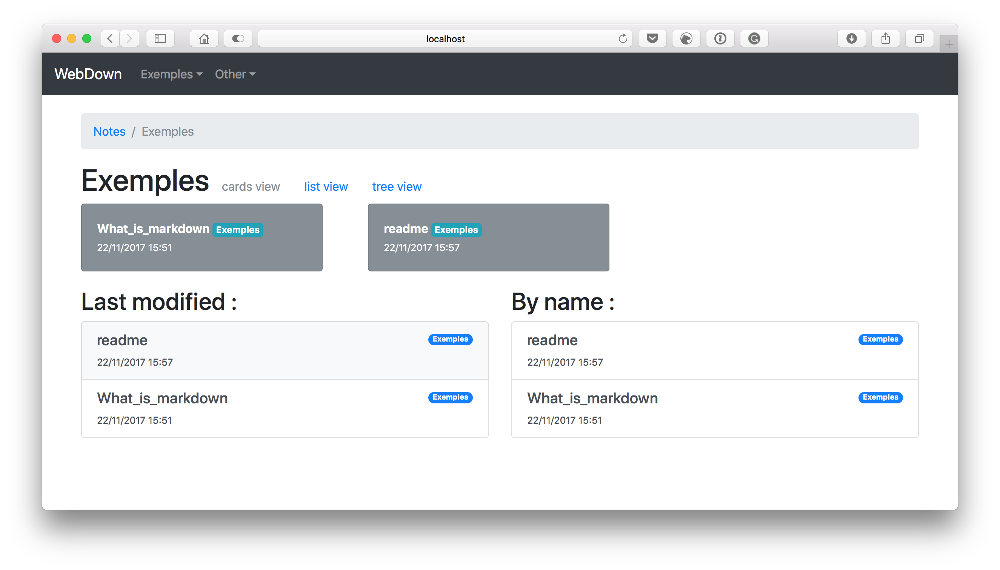
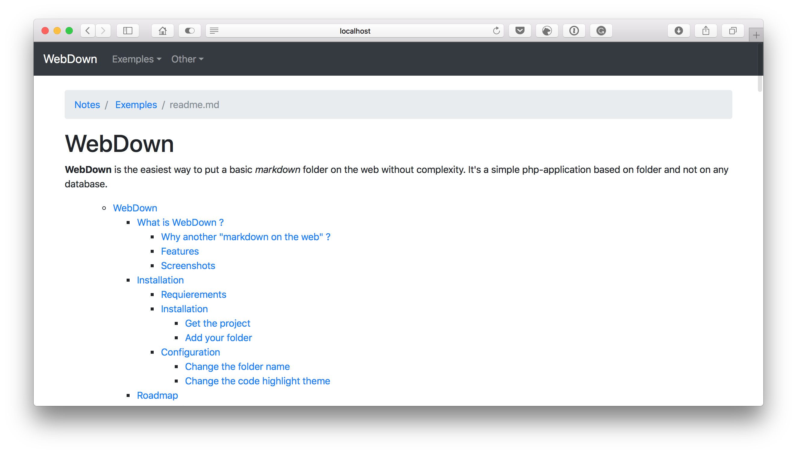
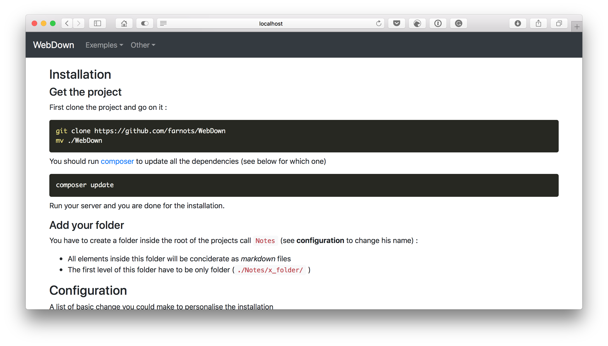

# WebDown

**WebDown** is the easiest way to put a basic *markdown* folder on the web without complexity. It's a simple php-application based on folder and not on any database.

[TOC]

## What is WebDown ?

### Why another "markdown on the web" ?

Markdown is the best way to write stuff, from a simple draft to a more complexe project. Lot of awesome markdown editor (like [Typora](https://typora.io)) are available for all plateforme but sometimes you want to seperate the editor to the viewer. It's why I create **WebDown**, to have access to all my markdown file, organized and stylized on all my device without any concern about the combatibilty, it's a *simple* web page.

### Features

- Folder based structure (no database)
- Full markdown support 
  - Markdown Github Flavour
  - TOC component
- Breadcrumb location
- Differents view style
  - Cards view
  - List view
  - Tree view
- Easy access to last modified file
- Group tag

### Screenshots








## Installation

### Requierements

**WebDown** is based on :

* php 7.* but should work on the 5.* version
* [composer](https://getcomposer.org) installed 
* A web seveur (or you computer, you could use [MAMP](https://www.mamp.info/en/))

### Installation

#### Get the project

First clone the project and go on it :

```bash
git clone https://github.com/farnots/WebDown
mv ./WebDown
```

You should run [composer](https://getcomposer.org) to update all the dependencies (see below for which one)

```bash
composer update
```

Run your server and you are done for the installation.

#### Add your folder

You have to create a folder inside the root of the projects call `Notes` (see **configuration** to change his name) :

- All elements inside this folder will be conciderate as *markdown* files
- The first level of this folder have to be only folder (`./Notes/x_folder/` )

### Configuration

A list of basic change you could make to personalise the installation

#### Change the folder name 

If you want to have to changer the `$dir` folder name on the file `index.php` at the root of the project :

```php
<?php session_start(); ?>
<!doctype html>

<?php

require_once 'vendor/autoload.php';

include("./function.php");
include("./phpFileTree/php_file_tree.php");

$dir = "./Notes"; //<----- CHANGE THIS LINE TO YOUR FOLDER NAME


//...........
```

#### Change the code highlight theme

For the higlighting theme I use [Prism JS](http://prismjs.com) which change the apparence of block code once they are created.

Go to there [website](http://prismjs.com), select the theme you want and download the *.css* and the *.js* file. You just to put them into the `./prism/` folder and erase the older one.

## Roadmap

This project is for now in **beta** but perfectly usable, some change could be add in the futur :

- Use of URLrewrinting for better url
- Search bar
- YAML support
- LateX and MathJax support
- Better citation support

## Acknowledgment

This project is based on other features made by awesome people :

- [Bootstrap v4.0](https://getbootstrap.com) for style and javascript ([github](https://github.com/twbs/bootstrap/blob/master/LICENSE))

  > The MIT License (MIT)
  >
  > Copyright (c) 2011-2016 Twitter, Inc.
  >
  > Permission is hereby granted, free of charge, to any person obtaining a copy
  > of this software and associated documentation files (the "Software"), to deal
  > in the Software without restriction, including without limitation the rights
  > to use, copy, modify, merge, publish, distribute, sublicense, and/or sell
  > copies of the Software, and to permit persons to whom the Software is
  > furnished to do so, subject to the following conditions:
  >
  > The above copyright notice and this permission notice shall be included in
  > all copies or substantial portions of the Software.
  >
  > THE SOFTWARE IS PROVIDED "AS IS", WITHOUT WARRANTY OF ANY KIND, EXPRESS OR
  > IMPLIED, INCLUDING BUT NOT LIMITED TO THE WARRANTIES OF MERCHANTABILITY,
  > FITNESS FOR A PARTICULAR PURPOSE AND NONINFRINGEMENT. IN NO EVENT SHALL THE
  > AUTHORS OR COPYRIGHT HOLDERS BE LIABLE FOR ANY CLAIM, DAMAGES OR OTHER
  > LIABILITY, WHETHER IN AN ACTION OF CONTRACT, TORT OR OTHERWISE, ARISING FROM,
  > OUT OF OR IN CONNECTION WITH THE SOFTWARE OR THE USE OR OTHER DEALINGS IN
  > THE SOFTWARE.

-  [Prism JS](http://prismjs.com) for higlighting the code ([github](https://github.com/PrismJS/prism))

  > MIT LICENSE
  >
  > Copyright (c) 2012 Lea Verou
  >
  > Permission is hereby granted, free of charge, to any person obtaining a copy
  > of this software and associated documentation files (the "Software"), to deal
  > in the Software without restriction, including without limitation the rights
  > to use, copy, modify, merge, publish, distribute, sublicense, and/or sell
  > copies of the Software, and to permit persons to whom the Software is
  > furnished to do so, subject to the following conditions:
  >
  > The above copyright notice and this permission notice shall be included in
  > all copies or substantial portions of the Software.
  >
  > THE SOFTWARE IS PROVIDED "AS IS", WITHOUT WARRANTY OF ANY KIND, EXPRESS OR
  > IMPLIED, INCLUDING BUT NOT LIMITED TO THE WARRANTIES OF MERCHANTABILITY,
  > FITNESS FOR A PARTICULAR PURPOSE AND NONINFRINGEMENT. IN NO EVENT SHALL THE
  > AUTHORS OR COPYRIGHT HOLDERS BE LIABLE FOR ANY CLAIM, DAMAGES OR OTHER
  > LIABILITY, WHETHER IN AN ACTION OF CONTRACT, TORT OR OTHERWISE, ARISING FROM,
  > OUT OF OR IN CONNECTION WITH THE SOFTWARE OR THE USE OR OTHER DEALINGS IN
  > THE SOFTWARE.

- [PHP File Tree](https://www.abeautifulsite.net/php-file-tree) for the tree view of your files

  > Made by **Cory LaViska**

- [Cebe Markdown](http://markdown.cebe.cc) for parsing the markdown file [github](https://github.com/cebe/markdown)

  > The MIT License (MIT)
  >
  > Copyright (c) 2014 Carsten Brandt
  >
  > Permission is hereby granted, free of charge, to any person obtaining a copy
  > of this software and associated documentation files (the "Software"), to deal
  > in the Software without restriction, including without limitation the rights
  > to use, copy, modify, merge, publish, distribute, sublicense, and/or sell
  > copies of the Software, and to permit persons to whom the Software is
  > furnished to do so, subject to the following conditions:
  >
  > The above copyright notice and this permission notice shall be included in all
  > copies or substantial portions of the Software.
  >
  > THE SOFTWARE IS PROVIDED "AS IS", WITHOUT WARRANTY OF ANY KIND, EXPRESS OR
  > IMPLIED, INCLUDING BUT NOT LIMITED TO THE WARRANTIES OF MERCHANTABILITY,
  > FITNESS FOR A PARTICULAR PURPOSE AND NONINFRINGEMENT. IN NO EVENT SHALL THE
  > AUTHORS OR COPYRIGHT HOLDERS BE LIABLE FOR ANY CLAIM, DAMAGES OR OTHER
  > LIABILITY, WHETHER IN AN ACTION OF CONTRACT, TORT OR OTHERWISE, ARISING FROM,
  > OUT OF OR IN CONNECTION WITH THE SOFTWARE OR THE USE OR OTHER DEALINGS IN THE
  > SOFTWARE.

- [Toc caseyamcl](https://github.com/caseyamcl/toc) for adding the `TOC` ability

  >The MIT License (MIT)
  >
  >Copyright (c) 2013-2014 Casey McLaughlin
  >
  >Permission is hereby granted, free of charge, to any person obtaining a copy of
  >this software and associated documentation files (the "Software"), to deal in
  >the Software without restriction, including without limitation the rights to
  >use, copy, modify, merge, publish, distribute, sublicense, and/or sell copies of
  >the Software, and to permit persons to whom the Software is furnished to do so,
  >subject to the following conditions:
  >
  >The above copyright notice and this permission notice shall be included in all
  >copies or substantial portions of the Software.
  >
  >THE SOFTWARE IS PROVIDED "AS IS", WITHOUT WARRANTY OF ANY KIND, EXPRESS OR
  >IMPLIED, INCLUDING BUT NOT LIMITED TO THE WARRANTIES OF MERCHANTABILITY, FITNESS
  >FOR A PARTICULAR PURPOSE AND NONINFRINGEMENT. IN NO EVENT SHALL THE AUTHORS OR
  >COPYRIGHT HOLDERS BE LIABLE FOR ANY CLAIM, DAMAGES OR OTHER LIABILITY, WHETHER
  >IN AN ACTION OF CONTRACT, TORT OR OTHERWISE, ARISING FROM, OUT OF OR IN
  >CONNECTION WITH THE SOFTWARE OR THE USE OR OTHER DEALINGS IN THE SOFTWARE.

  ​

  ​